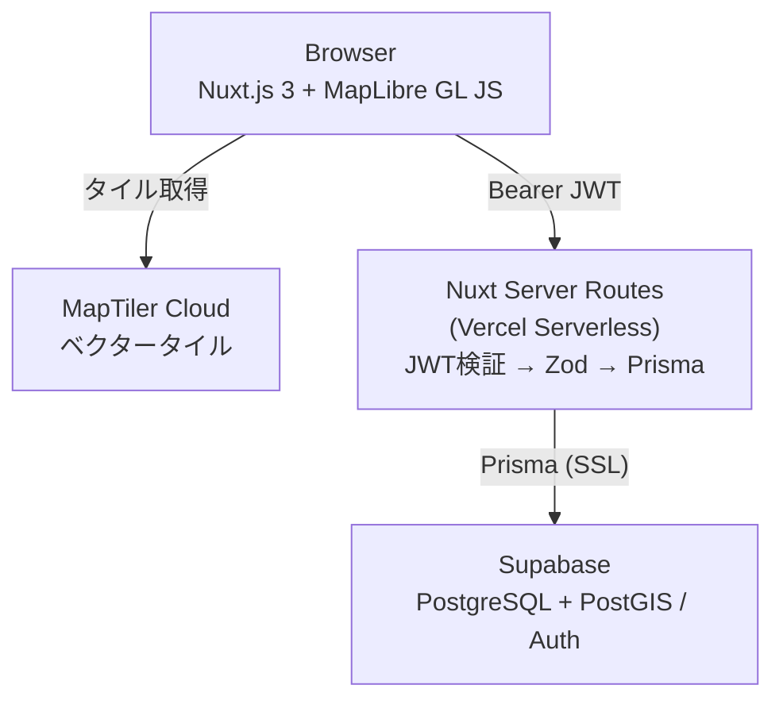

# Stamped Map Web App

[](https://github.com/kojikawazu/stamped-map-web-app/actions/workflows/ci.yml)
[](./LICENSE)

訪問済みのスポットを記録し、地図上にカテゴリ別の色付きピンで可視化する個人用 Web アプリ。地図をクリックして訪問先を登録し、一覧・検索・フィルターで振り返れる。

**Live Demo**: <!-- TODO: Vercel の公開 URL を記載 --> （準備中）

> 認証モデル: Google OAuth で誰でもログインできるが、**作成・編集・削除は `ALLOWED_EMAILS` に登録されたオーナーのみ**。それ以外のユーザーは閲覧専用。

## 目次

- [スクリーンショット](#スクリーンショット)
- [主な機能](#主な機能)
- [技術スタック](#技術スタック)
- [アーキテクチャ](#アーキテクチャ)
- [セットアップ](#セットアップ)
- [コマンド](#コマンド)
- [ドキュメント](#ドキュメント)
- [ライセンス](#ライセンス)

## スクリーンショット

> 📸 スクリーンショットは準備中。画像を `docs/assets/` に配置し、下記コメントを有効化して差し替えてください。

<!--
| メイン画面（地図 + 一覧） | スポット登録 |
|---|---|
|  |  |
-->

## 主な機能

- 🗺️ **地図表示** — MapLibre GL JS によるベクタータイル地図。地図位置（中心・ズーム）を localStorage に記憶し次回復元。
- 📍 **スポット登録/編集/削除** — 地図クリックで座標を取得し、名前・カテゴリ・訪問日・メモを登録。詳細はサイドドロワー、編集・削除はモーダル/確認ダイアログ。
- 🎨 **カテゴリ管理** — カテゴリごとに色を設定しマーカーを色分け。デフォルト5種 + カスタム追加・編集・削除（使用中は削除ガード）。
- 🔵 **マーカークラスタリング** — 近接ピンを件数付きクラスターに集約。ズームインで分離。
- 🔍 **検索・ソート・フィルター・ページネーション** — 名前部分一致検索、訪問日/登録日ソート、カテゴリ複数フィルター、20件/ページ。フィルター結果は一覧と地図マーカー双方に反映。
- 🔐 **認証** — Supabase Auth（メール/パスワード + Google OAuth）。Bearer トークン方式。書き込みはオーナー限定（`ALLOWED_EMAILS`）、非オーナーには Write 操作ボタンを非表示。
- 🔔 **UX** — トースト通知（vue-sonner）、ローディング表示、空状態ガイド。

詳細な機能要件・受け入れ基準は [`docs/02-requirements-specification.md`](docs/02-requirements-specification.md)、画面仕様は [`docs/03-functional-specification.md`](docs/03-functional-specification.md) を参照。

## 技術スタック

| レイヤー | 技術 |
|----------|------|
| フロントエンド | Nuxt.js 3 + TypeScript + Tailwind CSS v4 |
| 地図 | MapLibre GL JS + MapTiler Cloud |
| API | Nuxt Server Routes (Vercel Serverless) |
| ORM | Prisma + `@prisma/adapter-pg` |
| データベース | Supabase (PostgreSQL + PostGIS) |
| 認証 | Supabase Auth (`@nuxtjs/supabase`) |
| バリデーション | Zod（クライアント・サーバー共有） |
| テスト | Vitest + @vue/test-utils + @nuxt/test-utils / Playwright (E2E) |
| ホスティング | Vercel |

## アーキテクチャ

詳細は [`docs/09-architecture-specification.md`](docs/09-architecture-specification.md) を参照。



## セットアップ

### 前提条件

- Node.js 20+（CI は Node 20 で検証）
- pnpm 10+
- Supabase プロジェクト（PostgreSQL + PostGIS 有効化済み）
- MapTiler Cloud アカウント（API Key 発行済み）
- Google OAuth を使う場合: Google Cloud Console の OAuth 2.0 クライアント

### 1. 依存パッケージのインストール

```bash
cd front
pnpm install
```

### 2. 環境変数の設定

```bash
cd front
cp .env.example .env.local
```

`.env.local` を編集して各値を設定する：

| 変数 | 必須 | 説明 |
|------|------|------|
| `SUPABASE_URL` | ✓ | Supabase プロジェクト URL |
| `SUPABASE_KEY` | ✓ | Supabase Anon Key |
| `DATABASE_URL` | ✓ | Supabase 接続文字列（プーリング） |
| `DIRECT_URL` | ✓ | Supabase 直接接続（Prisma 用） |
| `NUXT_PUBLIC_MAPTILER_KEY` | ✓ | MapTiler API Key |
| `ALLOWED_EMAILS` | ✓ | Write 操作を許可するメールアドレス（カンマ区切り） |
| `NUXT_PUBLIC_SITE_URL` | - | サイト URL（OAuth リダイレクト先）。ローカルは省略可（`window.location.origin` にフォールバック） |
| `GOOGLE_CLIENT_ID` | OAuth時 | Google OAuth クライアント ID（Supabase の Provider 設定に登録） |
| `GOOGLE_CLIENT_SECRET` | OAuth時 | Google OAuth クライアントシークレット（同上） |

### 3. Google OAuth の設定（任意）

Google ログインを使う場合のみ：

1. Google Cloud Console で OAuth 2.0 クライアント ID を作成し、承認済みリダイレクト URI に `https://<project-ref>.supabase.co/auth/v1/callback` を追加。
2. Supabase ダッシュボード → Authentication → Providers → Google を有効化し、クライアント ID / シークレットを登録。

詳細は [`docs/design/m2-oauth-google-design.md`](docs/design/m2-oauth-google-design.md) を参照。

### 4. データベースのセットアップ

このプロジェクトは **マイグレーションファイルを持たず**、Prisma スキーマを DB に直接同期する運用（`db push`）。

```bash
cd front

# スキーマを Supabase に同期 + Prisma クライアント生成
pnpm exec prisma db push

# シードデータ投入（デフォルトカテゴリ + 確認用ダミースポット）
pnpm db:seed
```

> PostGIS の空間インデックス（`location` 生成カラム）は現状未使用。導入する場合は [`docs/05-data-specification.md`](docs/05-data-specification.md) のマイグレーション SQL を参照。

### 5. ユーザーアカウントの作成

サインアップ機能は提供していない。Supabase ダッシュボード → Authentication → Users → **Add user** で手動作成する。Write 操作を行うアカウントのメールは `ALLOWED_EMAILS` に登録する。

### 6. 開発サーバーの起動

```bash
cd front
pnpm dev
```

http://localhost:3000 でアクセスできる。

## コマンド

> すべてのコマンドは `front/` ディレクトリで実行する。

```bash
cd front

pnpm dev          # 開発サーバー起動
pnpm build        # ビルド
pnpm test         # ユニット/結合テスト（Vitest）
pnpm test:e2e     # E2E テスト（Playwright）
pnpm type-check   # 型チェック（nuxt typecheck = vue-tsc）
pnpm lint         # Lint（ESLint。JSDoc ルール含む）
pnpm format       # フォーマット適用（Prettier）
pnpm format:check # フォーマットチェック（Prettier）
pnpm db:seed      # シードデータ投入
```

## ドキュメント

仕様書・設計書は [`docs/`](docs/) に集約している。索引は [`docs/README.md`](docs/README.md)。

- 開発フロー・ブランチ運用・コントリビュート方法: [`CONTRIBUTING.md`](CONTRIBUTING.md)
- 詰まったとき: [`docs/troubleshooting.md`](docs/troubleshooting.md)
- 開発ルール（常時遵守）: [`CLAUDE.md`](CLAUDE.md) と [`.claude/rules/`](.claude/rules/)

## ライセンス

[MIT License](./LICENSE)
