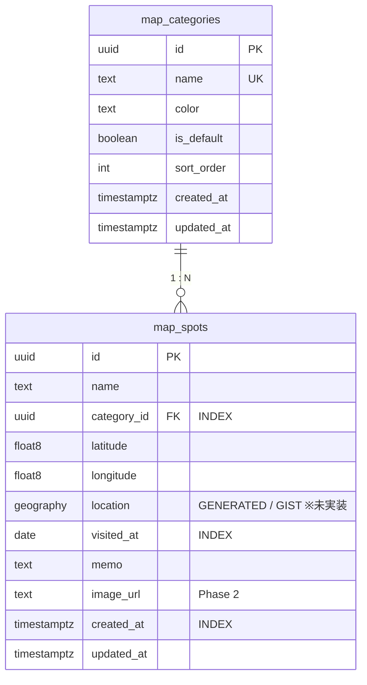

# Data Specification (データ仕様書)

## 目次

- [Prisma スキーマ](#prisma-スキーマ)
  - [マイグレーション追加SQL（PostGIS 空間インデックス用）※未実装（将来予定）](#マイグレーション追加sqlpostgis-空間インデックス用未実装将来予定)
- [テーブル詳細](#テーブル詳細)
  - [map_categories テーブル](#map_categories-テーブル)
  - [デフォルトカテゴリ（シードデータ）](#デフォルトカテゴリシードデータ)
  - [map_spots テーブル](#map_spots-テーブル)
- [ER図](#er図)
- [データ操作](#データ操作)
  - [Prisma 通常API（型安全CRUD）](#prisma-通常api型安全crud)
  - [空間クエリ（$queryRaw — 将来の拡張用 ※未実装）](#空間クエリqueryraw--将来の拡張用-未実装)
- [クライアント側データ保存（localStorage）](#クライアント側データ保存localstorage)
- [データフロー](#データフロー)

## Prisma スキーマ

```prisma
generator client {
  provider        = "prisma-client-js"
  previewFeatures = ["postgresqlExtensions"]
}

datasource db {
  provider   = "postgresql"
  url        = env("DATABASE_URL")
  directUrl  = env("DIRECT_URL")
  extensions = [postgis]
}

model MapCategory {
  id        String   @id @default(uuid())
  name      String   @unique
  color     String   @default("#6B7280")
  isDefault Boolean  @default(false) @map("is_default")
  sortOrder Int      @default(0) @map("sort_order")
  createdAt DateTime @default(now()) @map("created_at")
  updatedAt DateTime @updatedAt @map("updated_at")
  mapSpots  MapSpot[]

  @@map("map_categories")
}

model MapSpot {
  id         String      @id @default(uuid())
  name       String
  categoryId String      @map("category_id")
  category   MapCategory @relation(fields: [categoryId], references: [id])
  latitude   Float
  longitude  Float
  visitedAt  DateTime    @map("visited_at") @db.Date
  memo       String?
  imageUrl   String?     @map("image_url")
  createdAt  DateTime    @default(now()) @map("created_at")
  updatedAt  DateTime    @updatedAt @map("updated_at")

  @@index([categoryId])
  @@index([visitedAt])
  @@index([createdAt])
  @@map("map_spots")
}
```

### マイグレーション追加SQL（PostGIS 空間インデックス用）※未実装（将来予定）

> **ステータス：未実装。** 現状のスキーマ（`front/prisma/schema.prisma`）に `location` 生成カラム・GIST インデックスは存在せず、`prisma/migrations/` ディレクトリも未作成。マイグレーションは用いず、`prisma db push` でスキーマを DB に同期する運用（セットアップ手順は [`../README.md`](../README.md#4-データベースのセットアップ) を参照）。
> 空間検索を導入する段階で、生成カラムと GIST インデックスを以下の SQL で migration に手動追加する。生成カラムと GIST インデックスは Prisma スキーマだけでは定義できないため。

```sql
-- PostGIS 拡張の有効化
CREATE EXTENSION IF NOT EXISTS postgis;

-- 空間検索用の geography 生成カラムとGISTインデックス
ALTER TABLE map_spots
  ADD COLUMN location geography(Point, 4326)
  GENERATED ALWAYS AS (
    ST_SetSRID(ST_MakePoint(longitude, latitude), 4326)::geography
  ) STORED;

CREATE INDEX map_spots_location_gist ON map_spots USING GIST (location);
```

> `latitude` / `longitude` は通常の Float カラムとして Prisma で型安全に読み書き（現状の永続化はこちらのみ）。
> `location` 生成カラムは上記導入後に自動算出され、空間検索用インデックスの対象となる（未実装）。

## テーブル詳細

### map_categories テーブル

| カラム | 型 | 必須 | 制約 | 説明 |
|--------|----|------|------|------|
| id | uuid (PK) | ○ | | 自動生成 |
| name | text | ○ | **UNIQUE** | カテゴリ名 |
| color | text | ○ | | マーカー色（HEXカラーコード） |
| is_default | boolean | ○ | | デフォルトカテゴリか否か |
| sort_order | int | ○ | | 表示順 |
| created_at | timestamptz | ○ | | 作成日時（自動） |
| updated_at | timestamptz | ○ | | 更新日時（自動） |

### デフォルトカテゴリ（シードデータ）

| name | color | sort_order |
|------|-------|------------|
| 食事 | #EF4444 | 1 |
| 自然 | #22C55E | 2 |
| 観光 | #3B82F6 | 3 |
| ショッピング | #A855F7 | 4 |
| その他 | #6B7280 | 5 |

> 上記5件はいずれも `is_default = true` で投入される（`prisma/seed.ts`）。
> seed では加えて、スポットが0件の場合のみ確認用のダミースポット5件（渋谷スクランブル交差点・新宿御苑・築地場外市場・浅草寺・吉祥寺ハモニカ横丁）を投入する。

### map_spots テーブル

| カラム | 型 | 必須 | 制約 | 説明 |
|--------|----|------|------|------|
| id | uuid (PK) | ○ | | 自動生成 |
| name | text | ○ | | スポット名 |
| category_id | uuid (FK) | ○ | INDEX | カテゴリID → map_categories.id |
| latitude | float8 | ○ | | 緯度（-90〜90） |
| longitude | float8 | ○ | | 経度（-180〜180） |
| location | geography(Point, 4326) | - | GIST INDEX | 生成カラム（lat/lngから自動算出）※未実装（将来予定） |
| visited_at | date | ○ | INDEX | 訪問日 |
| memo | text | - | | メモ |
| image_url | text | - | | 写真URL（Phase 2） |
| created_at | timestamptz | ○ | INDEX | 作成日時（自動） |
| updated_at | timestamptz | ○ | | 更新日時（自動） |

## ER図



## データ操作

### Prisma 通常API（型安全CRUD）

```typescript
// スポット一覧取得
const spots = await prisma.mapSpot.findMany({
  include: { category: true },
  orderBy: { visitedAt: 'desc' },
  skip: (page - 1) * limit,
  take: limit,
});

// スポット登録
const spot = await prisma.mapSpot.create({
  data: {
    name, categoryId, latitude, longitude, visitedAt, memo,
  },
  include: { category: true },
});

// スポット更新
const spot = await prisma.mapSpot.update({
  where: { id },
  data: { name, categoryId, latitude, longitude, visitedAt, memo },
  include: { category: true },
});

// スポット削除
await prisma.mapSpot.delete({ where: { id } });

// 名前検索
const spots = await prisma.mapSpot.findMany({
  where: { name: { contains: query, mode: 'insensitive' } },
  include: { category: true },
});

// カテゴリフィルター
const spots = await prisma.mapSpot.findMany({
  where: { categoryId: { in: categoryIds } },
  include: { category: true },
});
```

### 空間クエリ（$queryRaw — 将来の拡張用 ※未実装）

```typescript
// 半径1km以内のスポット取得（location 生成カラムを利用）
const nearby = await prisma.$queryRaw`
  SELECT id, name, latitude, longitude
  FROM map_spots
  WHERE ST_DWithin(
    location,
    ST_SetSRID(ST_MakePoint(${lng}, ${lat}), 4326)::geography,
    ${radius}
  )
`;
```

## クライアント側データ保存（localStorage）

| キー | 値 | 用途 |
|------|-----|------|
| `map_center` | `[lng, lat]` | 地図の最後の中心座標 |
| `map_zoom` | `number` | 地図の最後のズームレベル |

## データフロー

```
【登録フロー】
ユーザー（地図クリック → モーダル入力）
  ↓ POST /api/spots + JWT
Server API（JWT検証）
  ↓ Prisma mapSpot.create({ latitude, longitude, ... })
Supabase PostgreSQL
  ↓ 成功レスポンス
クライアント → 地図にマーカー追加 + リスト更新

【一覧取得フロー】
クライアント
  ↓ GET /api/spots?sort=visited_at&order=desc&category=xxx&page=1&q=キーワード + JWT
Server API（JWT検証）
  ↓ Prisma mapSpot.findMany({ where, orderBy, skip, take, include })
Supabase PostgreSQL
  ↓ JSON レスポンス（spots[] + pagination info）
クライアント → リスト描画 + MapLibre でマーカー描画

【マーカー一括取得フロー】
クライアント
  ↓ GET /api/spots/markers + JWT
Server API（JWT検証）
  ↓ Prisma mapSpot.findMany({ select: { id, name, latitude, longitude, categoryId }, include: { category: { select: { color } } } })
Supabase PostgreSQL
  ↓ JSON レスポンス（id, name, latitude, longitude, categoryId, categoryColor）
クライアント → MapLibre で全マーカー描画（ポップアップに name 使用）

【カテゴリ管理フロー】
クライアント
  ↓ GET/POST /api/categories + JWT
Server API（JWT検証）
  ↓ Prisma mapCategory.findMany / mapCategory.create
Supabase PostgreSQL
  ↓ JSON レスポンス
クライアント → カテゴリプルダウン更新
```
